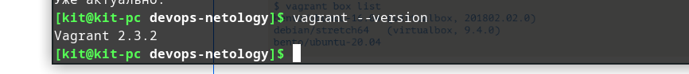
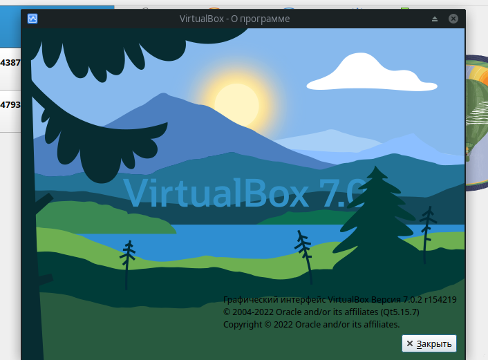

##Домашнее задание к занятию "2. Применение принципов IaaC в работе с виртуальными машинами"
---
###  Задача 1
* Возможность быстро получать сборки, а следовательно раньше узнавать о проблемах в версии и как следствие ускорение разработки
* Возможность иметь идентичные конфигурации на тестах и в проде, чтобы быть уверенными, что продукт на проде поведет себя ожидаемо
* Возможность быстро доставлять новые версии в прод

ДУмаю основное здесь - это ускорение получения потребителен новых фишек и следовательно увеличение интереса потребителя и повышение выручки

### Задача 2
* основное отличие на мой взгляд - это отсутствие агента и связь через ssh, т.е. не требуетася отдельной инфраструктуры( серверов, каналов связи) для использования Ansible.
* push - поскольку дает больше контроля за тем в каком состоянии находится инфраструктура в данный момент

### Задача 3 
Ansible

Vagrant

VirtualBox

