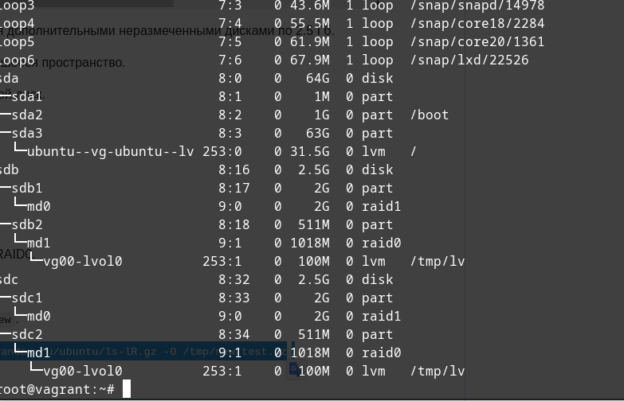
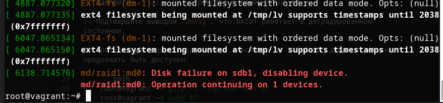

# Домашнее задание к занятию "3.5. Файловые системы"

1. Могут ли файлы, являющиеся жесткой ссылкой на один объект, иметь разные права доступа и владельца? Почему?
```
Нет, не могут. так как у них один и тот же inode.
```
2. Прикрепите вывод `lsblk`.



3. Подтвердите выводом `dmesg`, что RAID1 работает в деградированном состоянии.



