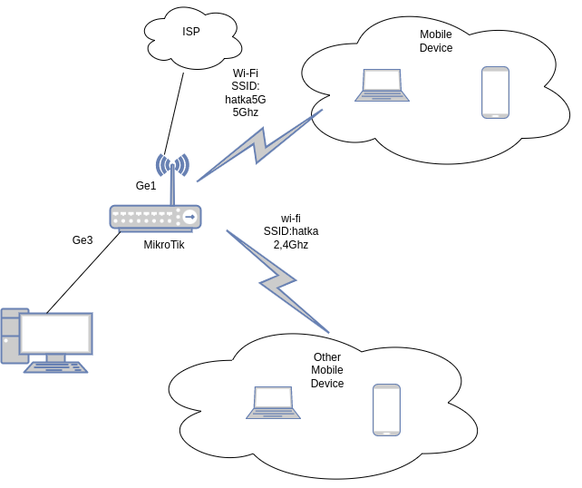

# Домашнее задание к занятию "3.8. Компьютерные сети, лекция 3"

1. Подключитесь к публичному маршрутизатору в интернет. Найдите маршрут к вашему публичному IP
```
telnet route-views.routeviews.org
Username: rviews
show ip route x.x.x.x/32
show bgp x.x.x.x/32
```
```
route-views>show ip route 188.134.72.2   
Routing entry for 188.134.0.0/17
  Known via "bgp 6447", distance 20, metric 0
  Tag 6939, type external
  Last update from 64.71.137.241 4w1d ago
  Routing Descriptor Blocks:
  * 64.71.137.241, from 64.71.137.241, 4w1d ago
      Route metric is 0, traffic share count is 1
      AS Hops 3
      Route tag 6939
      MPLS label: none
```
```
route-views>show bgp 188.134.72.2
BGP routing table entry for 188.134.0.0/17, version 311631538
Paths: (23 available, best #12, table default)
  Not advertised to any peer
  Refresh Epoch 1
  53767 174 174 1299 9049 41733
    162.251.163.2 from 162.251.163.2 (162.251.162.3)
      Origin incomplete, localpref 100, valid, external
      Community: 174:21000 174:22013 53767:5000
      path 7FE03A087610 RPKI State not found
      rx pathid: 0, tx pathid: 0
  Refresh Epoch 1
  701 1299 9049 41733
    137.39.3.55 from 137.39.3.55 (137.39.3.55)
      Origin incomplete, localpref 100, valid, external
      path 7FE111DA2A08 RPKI State not found
      rx pathid: 0, tx pathid: 0
  Refresh Epoch 1
  3356 9002 9002 9002 9002 9002 9049 41733
    4.68.4.46 from 4.68.4.46 (4.69.184.201)
      Origin IGP, metric 0, localpref 100, valid, external
      Community: 3356:2 3356:22 3356:100 3356:123 3356:503 3356:903 3356:2067
      path 7FE0E2D6F2D0 RPKI State not found
      rx pathid: 0, tx pathid: 0
  Refresh Epoch 1
  3333 9002 9049 41733
    193.0.0.56 from 193.0.0.56 (193.0.0.56)
      Origin IGP, localpref 100, valid, external
      path 7FE026DAC358 RPKI State not found
      rx pathid: 0, tx pathid: 0
  Refresh Epoch 1
  8283 1299 9049 41733
    94.142.247.3 from 94.142.247.3 (94.142.247.3)
      Origin incomplete, metric 0, localpref 100, valid, external
      Community: 1299:30000 8283:1 8283:101
      unknown transitive attribute: flag 0xE0 type 0x20 length 0x18
        value 0000 205B 0000 0000 0000 0001 0000 205B
              0000 0005 0000 0001 
      path 7FE0B4A96000 RPKI State not found
      rx pathid: 0, tx pathid: 0
  Refresh Epoch 1
  4901 6079 9002 9002 9002 9002 9002 9049 41733
    162.250.137.254 from 162.250.137.254 (162.250.137.254)
      Origin IGP, localpref 100, valid, external
      Community: 65000:10100 65000:10300 65000:10400
      path 7FE04A4EDE78 RPKI State not found
      rx pathid: 0, tx pathid: 0
  Refresh Epoch 1
  101 174 1299 9049 41733
    209.124.176.223 from 209.124.176.223 (209.124.176.223)
      Origin incomplete, localpref 100, valid, external
      Community: 101:20100 101:20110 101:22100 174:21000 174:22013
      Extended Community: RT:101:22100
      path 7FE0D3C7F650 RPKI State not found
      rx pathid: 0, tx pathid: 0
  Refresh Epoch 1
  852 1299 9049 41733
    154.11.12.212 from 154.11.12.212 (96.1.209.43)
      Origin IGP, metric 0, localpref 100, valid, external
      path 7FE123047088 RPKI State not found
      rx pathid: 0, tx pathid: 0
  Refresh Epoch 1
  1351 6939 9049 41733
    132.198.255.253 from 132.198.255.253 (132.198.255.253)
      Origin IGP, localpref 100, valid, external
      path 7FE0D90C6248 RPKI State not found
      rx pathid: 0, tx pathid: 0
  Refresh Epoch 1
  57866 9002 9049 41733
    37.139.139.17 from 37.139.139.17 (37.139.139.17)
      Origin IGP, metric 0, localpref 100, valid, external
      Community: 9002:0 9002:64667
      path 7FE103C04A70 RPKI State not found
      rx pathid: 0, tx pathid: 0
  Refresh Epoch 1
  20130 6939 9049 41733
    140.192.8.16 from 140.192.8.16 (140.192.8.16)
      Origin IGP, localpref 100, valid, external
      path 7FE096B8B090 RPKI State not found
      rx pathid: 0, tx pathid: 0
  Refresh Epoch 1
  6939 9049 41733
    64.71.137.241 from 64.71.137.241 (216.218.252.164)
      Origin IGP, localpref 100, valid, external, best
      path 7FE0E4364328 RPKI State not found
      rx pathid: 0, tx pathid: 0x0
  Refresh Epoch 1
  3549 3356 9002 9002 9002 9002 9002 9049 41733
    208.51.134.254 from 208.51.134.254 (67.16.168.191)
      Origin IGP, metric 0, localpref 100, valid, external
      Community: 3356:2 3356:22 3356:100 3356:123 3356:503 3356:903 3356:2067 3549:2581 3549:30840
      path 7FE043C9ED38 RPKI State not found
      rx pathid: 0, tx pathid: 0
  Refresh Epoch 1
  20912 3257 9002 9049 41733
    212.66.96.126 from 212.66.96.126 (212.66.96.126)
      Origin IGP, localpref 100, valid, external
      Community: 3257:8052 3257:50001 3257:54900 3257:54901 20912:65004 65535:65284
      path 7FE0DB7332D0 RPKI State not found
      rx pathid: 0, tx pathid: 0
  Refresh Epoch 1
  3303 6939 9049 41733
    217.192.89.50 from 217.192.89.50 (138.187.128.158)
      Origin IGP, localpref 100, valid, external
      Community: 3303:1006 3303:1021 3303:1030 3303:3067 6939:7040 6939:8752 6939:9002
      path 7FE10BD3AD78 RPKI State not found
      rx pathid: 0, tx pathid: 0
  Refresh Epoch 1
  7018 1299 9049 41733
    12.0.1.63 from 12.0.1.63 (12.0.1.63)
      Origin incomplete, localpref 100, valid, external
      Community: 7018:5000 7018:37232
      path 7FE0EF630968 RPKI State not found
      rx pathid: 0, tx pathid: 0
  Refresh Epoch 1
  3561 3910 3356 9002 9002 9002 9002 9002 9049 41733
    206.24.210.80 from 206.24.210.80 (206.24.210.80)
      Origin IGP, localpref 100, valid, external
      path 7FE1140EE518 RPKI State not found
      rx pathid: 0, tx pathid: 0
  Refresh Epoch 1
  7660 2516 1299 9049 41733
    203.181.248.168 from 203.181.248.168 (203.181.248.168)
      Origin incomplete, localpref 100, valid, external
      Community: 2516:1030 7660:9003
      path 7FE0F2F2BCA8 RPKI State not found
      rx pathid: 0, tx pathid: 0
  Refresh Epoch 2
  2497 1299 9049 41733
    202.232.0.2 from 202.232.0.2 (58.138.96.254)
      Origin incomplete, localpref 100, valid, external
      path 7FE105CE3DD0 RPKI State not found
      rx pathid: 0, tx pathid: 0
  Refresh Epoch 1
  49788 1299 9049 41733
    91.218.184.60 from 91.218.184.60 (91.218.184.60)
      Origin incomplete, localpref 100, valid, external
      Community: 1299:30000
      Extended Community: 0x43:100:1
      path 7FE17CAF28C8 RPKI State not found
      rx pathid: 0, tx pathid: 0
  Refresh Epoch 1
  1221 4637 9002 9049 41733
    203.62.252.83 from 203.62.252.83 (203.62.252.83)
      Origin IGP, localpref 100, valid, external
      path 7FE02EBA1368 RPKI State not found
      rx pathid: 0, tx pathid: 0
  Refresh Epoch 1
  3257 9002 9049 41733
    89.149.178.10 from 89.149.178.10 (213.200.83.26)
      Origin IGP, metric 10, localpref 100, valid, external
      Community: 3257:8052 3257:50001 3257:54900 3257:54901 65535:65284
      path 7FE0FDF5EF80 RPKI State not found
      rx pathid: 0, tx pathid: 0
  Refresh Epoch 1
  19214 174 1299 9049 41733
    208.74.64.40 from 208.74.64.40 (208.74.64.40)
      Origin incomplete, localpref 100, valid, external
      Community: 174:21000 174:22013
      path 7FE1756F4BC8 RPKI State not found
      rx pathid: 0, tx pathid: 0
```


2. Создайте dummy0 интерфейс в Ubuntu. Добавьте несколько статических маршрутов. Проверьте таблицу маршрутизации.
```
root@vagrant:~# ip route
default via 10.0.2.2 dev eth0 proto dhcp src 10.0.2.15 metric 100 
10.0.2.0/24 dev eth0 proto kernel scope link src 10.0.2.15 
10.0.2.2 dev eth0 proto dhcp scope link src 10.0.2.15 metric 100 
99.99.99.99 dev dummy0 scope link 


```
3. Проверьте открытые TCP порты в Ubuntu, какие протоколы и приложения используют эти порты? Приведите несколько примеров.
```
root@vagrant:~# ss -tnlp
State   Recv-Q  Send-Q   Local Address:Port    Peer Address:Port  Process                                     
LISTEN  0       4096     127.0.0.53%lo:53           0.0.0.0:*      users:(("systemd-resolve",pid=656,fd=13))  
LISTEN  0       128            0.0.0.0:22           0.0.0.0:*      users:(("sshd",pid=828,fd=3))              
LISTEN  0       128               [::]:22              [::]:*      users:(("sshd",pid=828,fd=4))              

```

Например, видно, что на порту 22 tcp на всех адресах висит сервер ssh.

4. Проверьте используемые UDP сокеты в Ubuntu, какие протоколы и приложения используют эти порты?
```
root@vagrant:~# ss -unlp
State   Recv-Q  Send-Q    Local Address:Port   Peer Address:Port  Process                                     
UNCONN  0       0         127.0.0.53%lo:53          0.0.0.0:*      users:(("systemd-resolve",pid=656,fd=12))  
UNCONN  0       0        10.0.2.15%eth0:68          0.0.0.0:*      users:(("systemd-network",pid=14396,fd=20)
```
Здесь видно, что 53 порт прослушивает служба DNS.

5. Используя diagrams.net, создайте L3 диаграмму вашей домашней сети или любой другой сети, с которой вы работали. 

 ---

