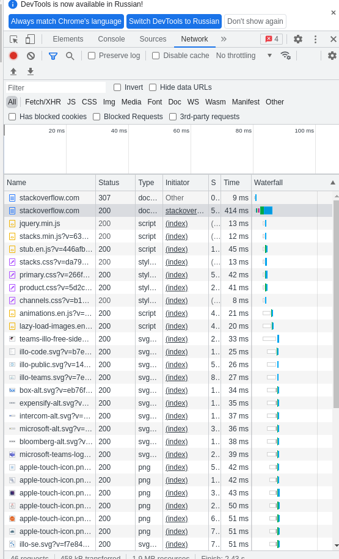
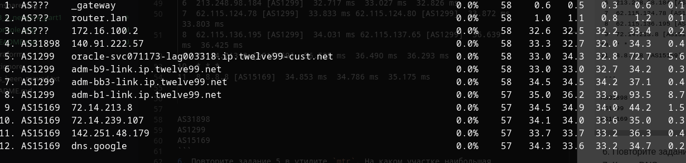

# Домашнее задание к занятию "3.6. Компьютерные сети, лекция 1"

1. Работа c HTTP через телнет.
- Подключитесь утилитой телнет к сайту stackoverflow.com
`telnet stackoverflow.com 80`
- отправьте HTTP запрос
```bash
GET /questions HTTP/1.0
HOST: stackoverflow.com
[press enter]
[press enter]
```
- В ответе укажите полученный HTTP код, что он означает?
```
HTTP/1.1 301 Moved Permanently
Код значит, что старница перемещена перманентно.
```
2. Повторите задание 1 в браузере, используя консоль разработчика F12.
- откройте вкладку `Network`
- отправьте запрос http://stackoverflow.com
- найдите первый ответ HTTP сервера, откройте вкладку `Headers`
- укажите в ответе полученный HTTP код.
```
307 Internal Redirect
```
- проверьте время загрузки страницы, какой запрос обрабатывался дольше всего?
```
запрос на загрузку страницы по адресу https://stackoverflow.com/
```
- приложите скриншот консоли браузера в ответ.

3. Какой IP адрес у вас в интернете?
```
188.134.72.2
```
4. Какому провайдеру принадлежит ваш IP адрес? Какой автономной системе AS? Воспользуйтесь утилитой `whois`
```
dom.ru
AS41733
```
5. Через какие сети проходит пакет, отправленный с вашего компьютера на адрес 8.8.8.8? Через какие AS? Воспользуйтесь утилитой `traceroute`
```
traceroute to 8.8.8.8 (8.8.8.8), 30 hops max, 60 byte packets
 1  10.0.2.2 [*]  0.423 ms  0.421 ms  0.372 ms
 2  192.168.88.1 [*]  0.851 ms  0.934 ms  0.739 ms
 3  172.16.100.2 [*]  32.496 ms  32.436 ms  32.863 ms
 4  140.91.222.61 [AS31898]  32.742 ms 140.91.222.85 [AS31898]  32.679 ms 140.91.222.35 [AS31898]  32.532 ms
 5  213.248.98.185 [AS1299]  32.952 ms  32.897 ms  32.868 ms
 6  213.248.98.184 [AS1299]  32.717 ms  33.027 ms  32.826 ms
 7  62.115.124.78 [AS1299]  33.833 ms 62.115.124.80 [AS1299]  33.872 ms  33.803 ms
 8  62.115.136.195 [AS1299]  34.031 ms 62.115.137.65 [AS1299]  36.639 ms  36.425 ms
 9  72.14.213.8 [AS15169]  36.525 ms  36.490 ms  36.293 ms
10  * * *
11  8.8.8.8 [AS15169]  34.853 ms  34.786 ms  35.175 ms
 
 ---

AS31898
AS1299
AS15169
```
6. Повторите задание 5 в утилите `mtr`. На каком участке наибольшая задержка - delay?

7. Какие DNS сервера отвечают за доменное имя dns.google? Какие A записи? воспользуйтесь утилитой `dig`
```
dns.google.		787	IN	A	8.8.8.8
dns.google.		787	IN	A	8.8.4.4

```
8. Проверьте PTR записи для IP адресов из задания 7. Какое доменное имя привязано к IP? воспользуйтесь утилитой `dig`
```
8.8.8.8.in-addr.arpa.	5692	IN	PTR	dns.google.
4.4.8.8.in-addr.arpa.	41947	IN	PTR	dns.google.
```